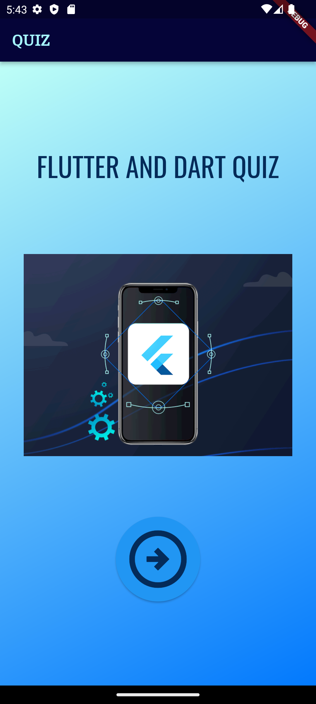
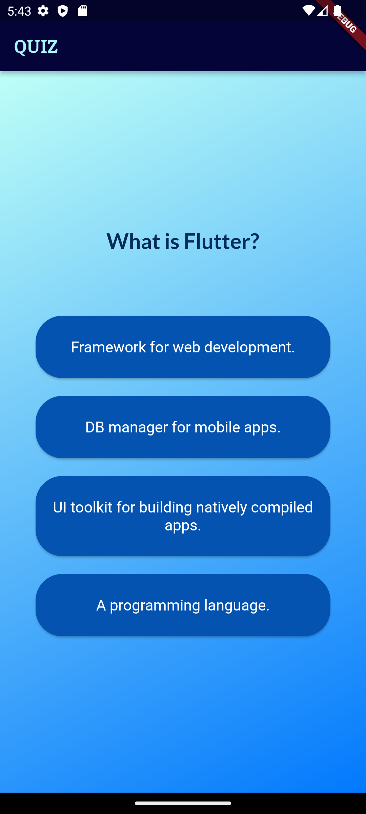
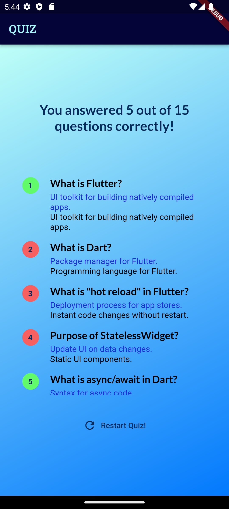

# Flutter Quiz App

This Flutter Quiz App is designed to test your knowledge of Flutter and Dart. It contains a series of questions, each with four possible answers. Only one of the answers is correct. Once you have completed the quiz, you will receive your results, including the number of correct answers and the correct answer for each question.

## Table of Contents

- [Download_APK](#download-apk)
- [Demo](#demo)
- [Getting Started](#getting-started)
- [Features](#features)
- [Screenshots](#screenshots)
- [Installation](#installation)
- [Usage](#usage)
- [Contributing](#contributing)

## Download APK:

<a href="https://drive.google.com/file/d/1sclOEmlNFjlN2s4RtJFUAakVQ6QKHgU3/view">
  
</a>

### Flutter Quiz Apk

[Direct download link](https://drive.google.com/file/d/1sclOEmlNFjlN2s4RtJFUAakVQ6QKHgU3/view)

## Demo


## Getting Started

Follow these instructions to get a copy of the project up and running on your local machine.

1. Clone the repository:

```bash
git clone https://github.com/PrathameshPatil-01/FLUTTER_AND_DART_QUIZ_APP.git
```

2. Navigate to the project directory:

```bash
cd FLUTTER_AND_DART_QUIZ_APP
```

3. Open the project in your preferred IDE or code editor.

## Features

- Quiz questions related to Flutter and Dart.
- Four possible answers for each question.
- Randomized correct answers for each question.
- Results screen displaying the number of correct answers and the correct answer for each question.

## Screenshots


|  |         |  |
| :--------------------------------:  | :---------------------------------------: | :----------------------------------:  |
|            Start Screen             |            Question Screen                |             Results Screen            |


## Installation

1. Ensure you have Flutter and Dart installed on your system.
2. Open the project in your IDE or code editor.
3. Install dependencies by running:

```bash
flutter pub get
```

## Usage

1. Run the app on your preferred emulator or device using:

```bash
flutter run
```

2. Answer the questions by selecting one of the provided options.
3. Once all questions are answered, the results screen will be displayed.

## Contributing

If you'd like to contribute to this project, feel free to fork the repository and submit a pull request.
